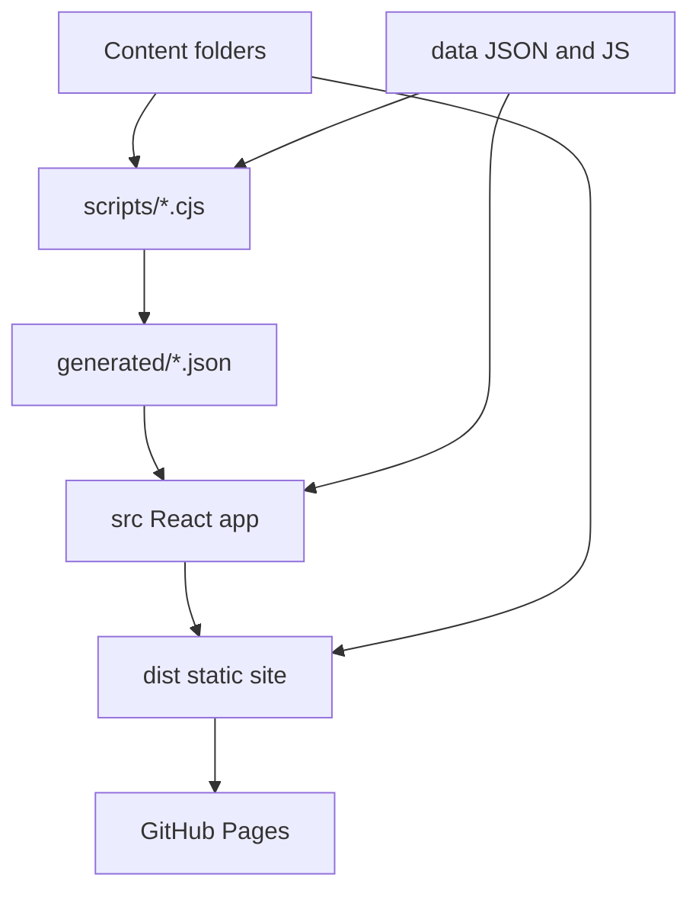
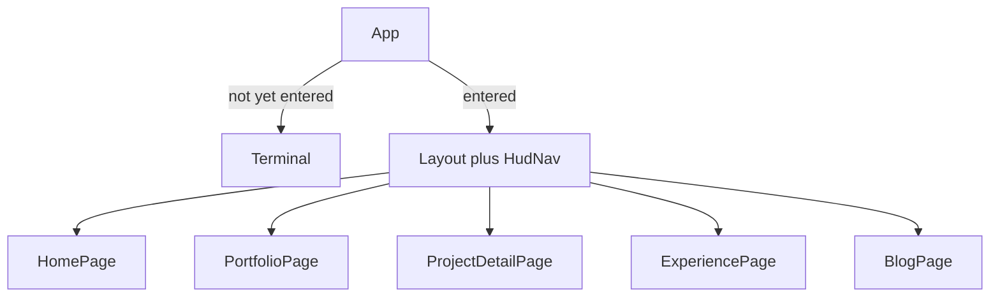

# Architecture

How jacobiglenn.com is put together. Shareable overview; implementation details stay in the `*logic.txt` files.

## Visitor flow

```mermaid
flowchart LR
  hit[Visit jacobiglenn.com]
  main[Main site]
  hit -->|first visit| term
  term -->|name / GO / Skip / Initialize then name| main
  hit -->|return within 24h or ?direct=1| main
  main --> home[Home]  main --> exp[Work Experience]
  main --> blog[Blog]
  port --> des[Designer]
  port --> dev[Developer]
```

The old glitch / games / “contemporary UI patches” path is gone. Terminal is optional flavor; the employer path is Skip or a saved visit.

## Repo tree



| Path | Role |
| `devProjects/`, `designProjects/`, `blog/` | One folder per case study or article |
| `data/experience.json`, `data/galleries.json` | Jobs, education, honors, photo stacks |
| `data/linkedin-posts.js`, `data/youtube-videos.js` | Short posts / videos |
| `scripts/` | Generators and `add:*` CLIs |
| `generated/` | JSON the UI imports |
| `src/` | Terminal, HUD, pages, themed components |
| `docs/` | Style, overhaul write-up, this file |

## App tree



`src/components/ui` is shadcn-style primitives (button, dialog). `src/components/site` is portfolio-specific: cards, photo stacks, button carousels, ASCII head, HTML write-up renderer.

## Deploy

Push to `main` → Actions injects API keys into `data/api-config.js` → `npm run build` → upload `dist/` (includes a `404.html` copy of `index.html` for SPA routes). Custom domain via `CNAME`.
